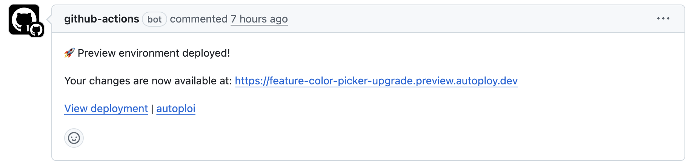

# autoploi (GitHub Action for Ploi.io server management)

Deploy and manage Ploi.io sites from GitHub Actions.

- deploy: create site, install repository, request Let's Encrypt, update deploy script, optionally create DB+user and set `DATABASE_URL`, apply .env lines, create daemons, and comment the PR with the URL.
- find-site-by-domain: look up a site ID by domain on a given server.
- delete-site: delete a site by ID.




## Usage (deploy)

Set up `PLOI_TOKEN` as a secret. You can register an API token [here](https://ploi.io/profile/api-keys)

```yamlname: Deploy preview environment on Ploi

on:
  workflow_dispatch:
  pull_request:
    types: [opened]
jobs:
  deploy:
    runs-on: ubuntu-latest
    permissions:
      contents: read
      pull-requests: write
      repository-projects: write
      issues: write
    steps:
      - name: Set branch and domain
        id: vars
        run: |
          if [ "${{ github.event_name }}" = "pull_request" ]; then
            BRANCH="${{ github.event.pull_request.head.ref }}"
          else
            BRANCH="${{ github.ref_name }}"
          fi
          echo "branch=$BRANCH" >> "$GITHUB_OUTPUT"
          echo "domain=${BRANCH}.domain.com" >> "$GITHUB_OUTPUT"

      - name: Autoploi (deploy)
        uses: janyksteenbeek/autoploi@main
        with:
          action: deploy
          ploi_token: ${{ secrets.PLOI_TOKEN }}
          github_token: ${{ github.token }}
          server_id: "12345"
          domain: ${{ steps.vars.outputs.domain }}
          branch: ${{ steps.vars.outputs.branch }}
          project_type: laravel
          deploy_script: |
            php artisan down || true
            composer install --no-interaction --prefer-dist --optimize-autoloader
            php artisan migrate --force
            php artisan up
          environment: |
            APP_ENV=production
            APP_DEBUG=false
            APP_KEY=${{ secrets.APP_KEY }}
          daemons: |
            - php artisan queue:work --queue=default --sleep=1 --tries=3
          create_database: "true"
          database_engine: mysql
```

Outputs:
- `site_id`: created site ID
- `url`: https://example.com

## Usage (find-site-by-domain)

```yaml
- name: Find site by domain
  id: find
  uses: janyksteenbeek/autoploi@main
  with:
    action: find-site-by-domain
    ploi_token: ${{ secrets.PLOI_TOKEN }}
    server_id: "12345"
    domain: example.com
```

Outputs:
- `site_id`: found site ID

## Usage (delete-site)

```yaml
- name: Delete site
  uses: janyksteenbeek/autoploi@main
  with:
    action: delete-site
    ploi_token: ${{ secrets.PLOI_TOKEN }}
    server_id: "12345"
    site_id: ${{ steps.find.outputs.site_id }}
```

## Example: use find-site-by-domain output in next step

```yaml
yaml
- name: Find site by domain (allow missing)
  id: find
  continue-on-error: true
  uses: janyksteenbeek/autoploi@main
  with:
    action: find-site-by-domain
    ploi_token: ${{ secrets.PLOI_TOKEN }}
    server_id: "12345"
    domain: example.com

- name: Delete only if found
  if: steps.find.outputs.site_id != ''
  uses: janyksteenbeek/autoploi@main
  with:
    action: delete-site
    ploi_token: ${{ secrets.PLOI_TOKEN }}
    server_id: "12345"
    site_id: ${{ steps.find.outputs.site_id }}
```


## Security Vulnerabilities

If you are an outside collaborator and discover a security vulnerability within this repository, please send an e-mail to our security team via [security-external@webmethod.nl](mailto:security-external@webmethod.nl). **Do not use GitHub Issues** to report security vulnerabilities. All security vulnerabilities will be promptly addressed. Please adhere to the [Webmethod Coordinated Vulnerability Disclosure guidelines](https://www.webmethod.nl/juridisch/responsible-disclosure) at all times.

## License

The MIT License (MIT).

## Disclaimer

This package is not affiliated with or endorsed by WebBuilds B.V. (Ploi). Ploi® is an official registered trademark of WebBuilds B.V and all rights pertaining to the trademark are the exclusive property of the trademark owner.